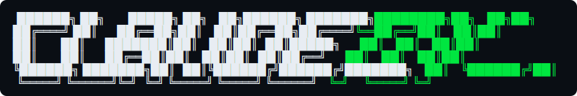
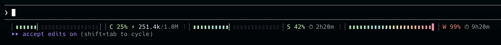
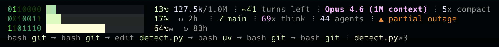

<p align="center">
  
</p>

[](https://github.com/slima4/claude-tui/releases)
[](https://github.com/slima4/claude-tui/stargazers)
[](https://github.com/slima4/claude-tui/commits/main)
[](https://github.com/slima4/claude-tui/blob/main/LICENSE)
[]()
[]()

A real-time **statusline** for Claude Code — context, cost, usage bars, sparkline, and live tool trace, right inside your session.

**Website:** [slima4.github.io/claude-tui](https://slima4.github.io/claude-tui/)

---

## Statusline

**Compact mode** — everything in one line:



```bash
claudetui mode compact
```

**Full mode** — three lines with context, session/weekly usage bars, sparkline, and live tool trace:



```bash
claudetui mode full
```

See the [statusline README](./claude-code-statusline/README.md) for the full feature list, customization (`claudetui mode custom`), widgets, color thresholds, and debugging flags.

---

## Install

### macOS (Homebrew)

```bash
brew tap slima4/claude-tui
brew install claude-tui
claudetui setup       # configure statusline, hooks, and commands
```

### macOS / Linux (script)

```bash
curl -sSL https://raw.githubusercontent.com/slima4/claude-tui/main/install.sh | bash
```

Or clone and install locally:

```bash
git clone https://github.com/slima4/claude-tui.git && ./claude-tui/install.sh
```

### Windows (WSL)

ClaudeTUI requires a Unix-like environment. On Windows, use [WSL 2](https://learn.microsoft.com/en-us/windows/wsl/install):

```bash
curl -sSL https://raw.githubusercontent.com/slima4/claude-tui/main/install.sh | bash
```

### Uninstall

```bash
claudetui uninstall
brew uninstall claude-tui
```

If you already ran `brew uninstall` first:

```bash
curl -sSL https://raw.githubusercontent.com/slima4/claude-tui/main/uninstall.sh | bash
```

---

## More tools

ClaudeTUI ships a few companion utilities alongside the statusline. Each lives in its own directory with its own README:

| Tool | What it does |
|------|--------------|
| [claude-code-statusline](./claude-code-statusline/) | The statusline itself — full docs, widgets, color thresholds |
| [claude-code-monitor](./claude-code-monitor/) | Live session dashboard for a second terminal — `claudetui monitor` |
| [claude-code-sniffer](./claude-code-sniffer/) | API call interceptor proxy — `claudetui sniffer` / `claudetui sniff` |
| [claude-code-session-stats](./claude-code-session-stats/) | Post-session analytics — `claudetui stats` |
| [claude-code-session-manager](./claude-code-session-manager/) | Browse, compare, resume, and export sessions — `claudetui sessions list` |
| [claude-code-hooks](./claude-code-hooks/) | Hooks for automatic in-session context: hotspots, reverse deps, churn |
| [claude-code-commands](./claude-code-commands/) | Custom slash commands: `/tui:session`, `/tui:cost`, `/tui:perf`, `/tui:context` |
| [claude_tui_core](./claude_tui_core/) | Shared domain logic — models, pricing, network, settings |
| [claude_tui_components](./claude_tui_components/) | Shared UI library — progress bars, sparklines, widgets, colors |

## License

MIT
